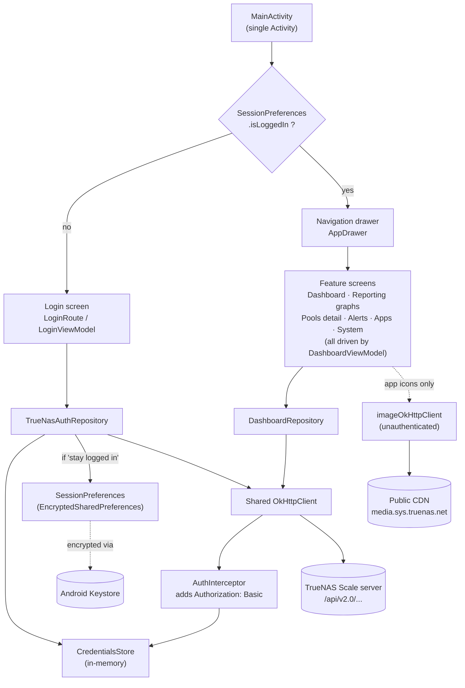

# NasManager App

Android mobile app for connecting to a **TrueNAS Scale** server via its official API (`/api/v2.0`), and viewing a near-real-time system dashboard straight from your phone.

## Tech stack

- **Kotlin** + **Jetpack Compose** (Material 3) — Android native only for now, no iOS version yet.
- **OkHttp** for network calls to the TrueNAS Scale API (manual REST calls, no Retrofit).
- **Gson** for JSON serialization.
- **Coroutines / StateFlow** for async state management (MVVM architecture).

## Architecture

Single Activity, state-driven navigation (no Navigation-Compose), MVVM with manual DI (no framework — `TrueNasApplication` holds the shared singletons as `by lazy` properties). See `CLAUDE.md` for the full breakdown per feature.



- **Auth is stateless**: every request carries its own `Authorization: Basic` header (added by `AuthInterceptor` from whatever `CredentialsStore` currently holds) — there's no session cookie, so logging in only means validating credentials once against `GET /system/info` and keeping them for later requests.
- **One `DashboardViewModel`/`DashboardUiState` feeds every post-login screen** (Dashboard, reporting graphs, pool detail, Alerts, Apps, System) — navigation between them is local Compose state (`var ... by remember` in `DashboardScreen.kt`), not a router.
- **`imageOkHttpClient` is deliberately separate and unauthenticated**: app icons are served from a public CDN, not the user's TrueNAS, so the NAS credentials must never be sent there.

## Authentication

TrueNAS Scale doesn't expose a REST login/session route (`auth.login` exists on the middleware but only over WebSocket JSON-RPC). The app therefore authenticates via **HTTP Basic Auth** (TrueNAS username + password, sent on every request) — no session cookie, auth is stateless.

Unencrypted HTTP (no certificate) is allowed to any address (IP or hostname), but only after the user has explicitly checked a box accepting the associated risks. HTTPS remains recommended — see `CONNECTIVITY_TODO.md` for the connection scenarios covered.

> ⚠️ **Recommendation**: use a TrueNAS account **dedicated to the app**, with reduced permissions (read-only on the screens used, plus app-update permission if you plan to use it), rather than the main admin account. The password is sent base64-encoded (Basic Auth, not encryption) on every request — in the clear if you use HTTP mode — a dedicated account limits the damage in case of interception.

## Features

- [x] Login screen (server address, credentials, "stay logged in" option)
- [x] Authentication via Basic Auth, validated by a GET `/api/v2.0/system/info`
- [x] Session persistence (encrypted credentials + local preferences)
- [x] Post-login dashboard: system info, CPU (total + per core), memory (Services / ZFS Cache / Free breakdown), pools & storage — CPU/memory/pools refreshed every 2s
- [x] Detailed reporting graphs for CPU, Memory and Pools & Storage (CPU/Memory history, Pools detail per pool then per disk)
- [x] Navigation menu (side drawer): Dashboard, Storage, Reporting, Apps, System, Alerts, Logout
- [x] System back button/gesture steps back through the drawer navigation instead of closing the app
- [x] System alerts (badge, list, "Dismiss" per alert — real server call)
- [x] Installed apps: status, individual or bulk update ("Update All"); catalog ("Discover Apps") not browsable yet
- [x] System screen: General settings, Network, Boot (read-only)
- [ ] Other NAS features (shares, snapshots, VMs...)
- [ ] iOS version

## Requirements

- Android Studio (latest stable version)
- JDK 17+ (required by the Android Gradle Plugin 9)
- A TrueNAS Scale server reachable from the phone/emulator, with the REST API enabled

## Getting started

```bash
./gradlew assembleDebug
```

Or simply open the project in Android Studio and run the app on an emulator/device (`minSdk 35`).

On the login screen, provide:
- the server address (e.g. `https://192.168.1.10`)
- your TrueNAS username and password

> Note: if your TrueNAS uses a self-signed certificate, it must be imported into Android's security settings for the HTTPS connection to succeed.

## Building a signed release

```bash
./gradlew assembleRelease
```

Without any further setup this produces an **unsigned** APK (`app-release-unsigned.apk`) — fine
for local testing, not installable as an update or uploadable to a store listing. To get a signed
`app-release.apk` instead, set these four properties in your own `~/.gradle/gradle.properties`
(never in this repo):

```properties
RELEASE_STORE_FILE=/absolute/path/to/your.keystore
RELEASE_STORE_PASSWORD=...
RELEASE_KEY_ALIAS=...
RELEASE_KEY_PASSWORD=...
```

`app/build.gradle.kts` reads them via `providers.gradleProperty(...)` and only creates the
`release` signing config when `RELEASE_STORE_FILE` is present, so the build never fails for a
contributor who doesn't have the signing key. The keystore itself and its passwords are kept and
backed up outside this repository — see `SECURITY_TODO.md`.

## Project structure

```
app/src/main/java/com/nasmanagerapp/
├── data/
│   ├── auth/       # Auth repository (Basic Auth) + session persistence
│   ├── network/    # OkHttp client, credentials, HTTP/HTTPS policy
│   └── dashboard/  # Dashboard repository + models (system.info, pool.query, reporting)
├── ui/
│   ├── login/      # Login screen and ViewModel
│   ├── dashboard/  # Dashboard, reporting graphs, navigation drawer, Alerts, Apps
│   └── theme/      # Material 3 theme
├── MainActivity.kt
└── TrueNasApplication.kt
```

## Tests

```bash
./gradlew testDebugUnitTest
```

## Further documentation

- `CLAUDE.md` — architecture overview, for AI tools (and humans).
- `CONNECTIVITY_TODO.md` — detailed connectivity/auth tracking: network scenarios covered, tests done and pending, security points not to forget before production.
- `REPORTING_TODO.md` — reporting graphs tracking (API formats verified live, UI tests pending).
- `ALERTS_TODO.md` — alerts tracking (`alert.list`/`alert.dismiss`, formats verified live, tests pending).
- `APPS_TODO.md` — apps tracking (`app.query`/`app.upgrade`, what only exists over WebSocket on the TrueNAS side, tests pending).
- `SYSTEM_TODO.md` — System screen tracking (`system.general`/`network.configuration`/`interface`/`boot.get_state`/`boot.environment`, formats verified live, tests pending).
- `SECURITY_TODO.md` — security testing tracking (static and dynamic).

## License

Copyright (C) 2026 Julie POUNY

This program is free software: you can redistribute it and/or modify it under the terms of the
GNU General Public License as published by the Free Software Foundation, either version 3 of the
License, or (at your option) any later version. See [LICENSE](LICENSE) for the full text.

The app icon (launcher icons under `app/src/main/res/mipmap-*` and `fastlane/metadata/android/*/images/icon.png`)
was generated by the author with Google Gemini and is dedicated to the public domain under
[CC0 1.0](https://creativecommons.org/publicdomain/zero/1.0/).
